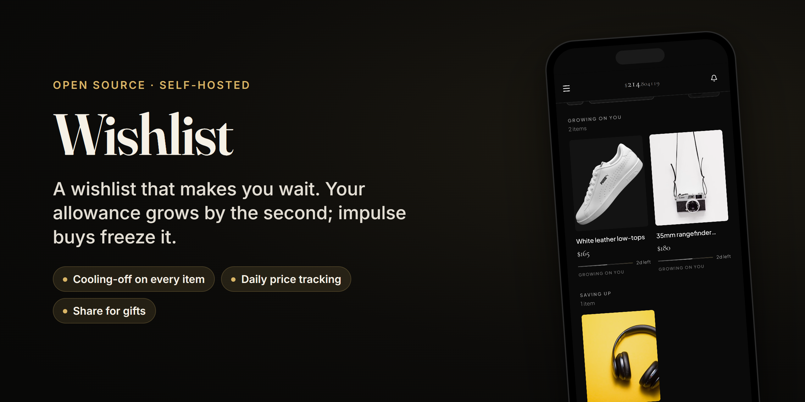
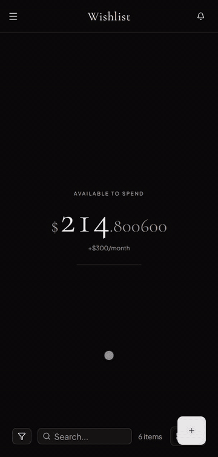
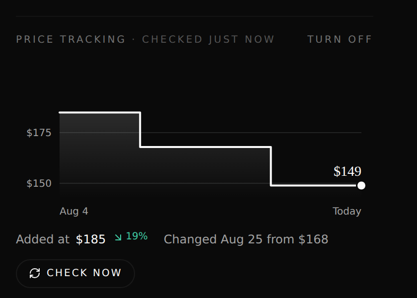
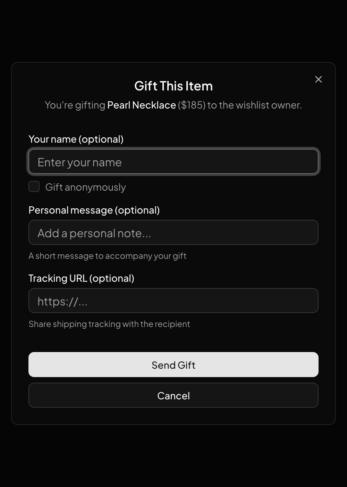

<p align="center">
  
</p>

**A wishlist that makes you wait.** Set a monthly allowance and watch it grow by the
second. Everything you want sits on the list until it has cooled off and you can afford
it, and buying on impulse freezes your balance for a week.

<p align="center">
  
</p>

- **Money you can see.** Your allowance accrues continuously, so `$214.807159` becomes
  `$214.807160` while you watch. A purchase comes straight off the top.
- **A cooling-off period on everything.** You set the rule ("3 days for every $100"), and
  each item shows how long it has left: *Growing on you · 2d left*, then *Ready to treat*.
- **Impulse has a price.** Buy something before it's ready and the balance stops for 7 days.
- **Paste a link, get the product.** Name, photo and price come from the URL, including
  shops that block scrapers.
- **Prices watched for you.** Every item is re-checked daily; drops and rises notify you,
  and a dead link says why instead of recording a wrong price.
- **Share it for gifts.** Friends see your list and can gift an item with a note and a
  tracking link; it comes off your list and you get a notification.
- **Installs like an app** on iOS and Android, with push notifications.

<p align="center">
  
  
</p>

---

## Why This Exists

I built this for my wife.

When she wants something (moisturizers, jewelry, whatever), she does research. Comparing products, reading reviews, thinking it through. This leads to a dozen open tabs. The app lets her add all of those in one place, making it easier to keep track and compare.

The other thing: tapping "buy" online doesn't feel like spending money. There's no wallet getting thinner. The budget gives that back. A number that goes up and down, making spending feel concrete again. And showing prices in days instead of dollars puts the cost in perspective.

---

## Development

### Prerequisites

- Docker and Docker Compose
- Node.js 20+
- Python 3.12+ with [uv](https://github.com/astral-sh/uv)

### Quick Start

```bash
# Start the full stack
docker compose watch
```

This starts:
- Frontend at [localhost:5173](http://localhost:5173)
- Backend API at [localhost:8000](http://localhost:8000)
- PostgreSQL database
- Mailcatcher for email testing

### Manual Setup

```bash
# Backend
cd backend
uv sync
uv run alembic upgrade head
uv run fastapi dev app/main.py

# Frontend (separate terminal)
cd frontend
npm install
npm run dev
```

### Commands

```bash
# Backend
uv run pytest                    # Run tests
uv run ruff check --fix .        # Lint
uv run mypy .                    # Type check

# Frontend
npm run build                    # Build for production
npm run lint                     # Lint with Biome
npm run generate-client          # Regenerate API client

# Database
uv run alembic revision --autogenerate -m "description"
uv run alembic upgrade head
```

---

## Architecture

```
wishlist/
├── backend/                 # FastAPI + SQLModel
│   ├── app/
│   │   ├── features/        # Domain modules (budget, wishlist, users)
│   │   ├── core/            # Config, security, database
│   │   └── alembic/         # Database migrations
│   └── tests/
├── frontend/                # React + TypeScript + Vite
│   ├── src/
│   │   ├── components/      # UI components
│   │   ├── routes/          # TanStack Router pages
│   │   ├── client/          # Auto-generated API client
│   │   └── hooks/           # Custom React hooks
│   └── public/
└── docker-compose.yml
```

**Backend:** FastAPI with SQLModel ORM. Feature-based structure where each domain (budget, wishlist items, users) has its own models, service, and router.

**Frontend:** React 19 with TanStack Router and Query. UI built with Tailwind CSS and shadcn/ui. Mobile-first, installable as a PWA.

**URL Parsing:** Extracts product metadata from any shopping site using OpenGraph, JSON-LD, and microdata. Includes anti-bot bypass for sites with aggressive protection.

---

## Tech Stack

| Layer      | Technology                                       |
|------------|--------------------------------------------------|
| Frontend   | React, TypeScript, Vite, Tailwind CSS, shadcn/ui |
| Routing    | TanStack Router (file-based)                     |
| State      | TanStack Query                                   |
| Backend    | FastAPI, SQLModel, Pydantic                      |
| Database   | PostgreSQL                                       |
| Auth       | JWT tokens                                       |
| Deployment | Docker Compose, Tailscale                        |

---

## License

Released under the GNU Affero General Public License v3.0 — see [LICENSE](LICENSE). If you run a modified version where other people can reach it, the AGPL asks you to publish your changes too.