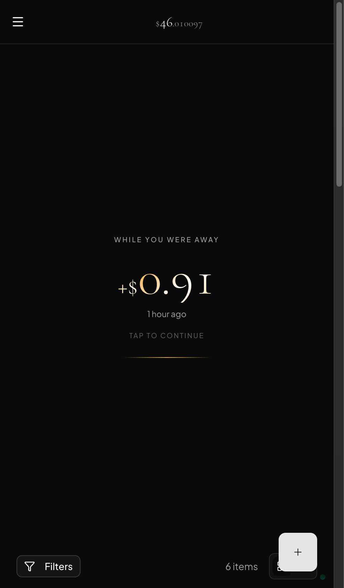
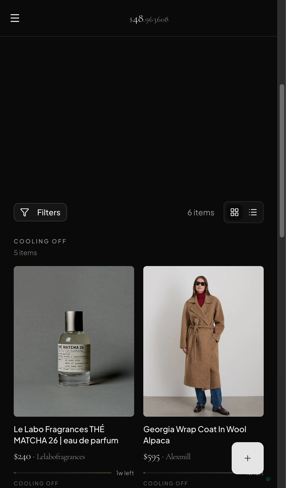

<p align="center">
  
</p>

---

Wishlist helps you manage the things you want so you can buy the things you actually want without the guilt.

- 💰 **Set a budget** — Pick a monthly amount. Watch it grow in real-time.
- 📝 **Add what you want** — Paste any product URL. The app pulls in the details automatically.
- ⏳ **Wait before buying** — A cool-off period helps you separate impulse from intent. Get penalized if you cave too early.
- 📊 **Track prices** — Automatic daily price monitoring. Get notified of drops and rises.
- 📦 **Track delivery** — Link tracking numbers to items and monitor shipments in real-time.
- 🎯 **Prioritize** — Set your most wanted item. Everything else is measured against it.
- 🔗 **Share wishlists** — Share your list with friends and family.
- ✨ **Buy guilt-free** — When you've saved and waited, it feels earned.
- 📱 **Install on mobile** — Works as a PWA app on iOS and Android.
- 🗂️ **Or let it go** — Removing something you don't need? That's clarity, not failure.

---

## How It Works

**Add anything you want.** Paste a URL from any shopping site. The app extracts product name, image, and price automatically. We handle sites with anti-bot protection so you don't have to.

**Watch your budget grow in real-time.** Set a monthly amount and watch it accumulate down to the cent. Open the app after a few days and see exactly how much you've earned by waiting.

**Prices tracked automatically.** Every day, we check prices on items you've wishlisted. If a price drops, you get notified. If a link breaks, we tell you exactly why and give you options to recover.

**Get a cool-off period.** Each item has a minimum wait time. Bought an item within a week of adding it? Your budget freezes for 7 days—a penalty that encourages you to separate impulse from intent. Items on your list for a month? No penalty.

**Track deliveries.** Add a tracking number to any item and watch it travel. Get status updates as it ships, arrives, and gets delivered.

**Buy without guilt.** When an item is ready, you can afford it, and you've waited long enough, you've genuinely earned it. Mark it as bought. Celebrate.

---

## Key Features

**Impulse Control Built In.** Buy an item within a week of adding it? Your budget freezes for 7 days—a gentle reminder that waiting is the point. Items on your list for a month or more? No penalty. The system rewards patience.

**Price Tracking That Actually Works.** We check prices daily, but only for sites we can actually read. Broken links get flagged with a specific reason ("Link moved", "Different product", etc.) so you know what happened. Manual recovery options let you restart tracking or disable it per item. Get notified when prices drop or spike.

**Track What You've Ordered.** Link tracking numbers to items and see real-time updates from couriers. Know exactly when your purchase is arriving.

**Organize Anything.** Create categories to group items—Skincare, Jewelry, Clothing, whatever makes sense. Smart suggestions help categorize items as you add them. Share your whole list with friends or family.

**Notifications That Matter.** Get alerts for price changes, upcoming freeze expirations, budget milestones reached, and delivery status updates. Push notifications work on mobile and desktop.

**Works Offline, Installable.** Add Wishlist to your home screen on iOS or Android. It works like a native app, even without internet.

---

## Screenshots

<p align="center">
  
  
  
</p>

---

## Why This Exists

I built this for my wife.

When she wants something (moisturizers, jewelry, whatever), she does research. Comparing products, reading reviews, thinking it through. This leads to a dozen open tabs. The app lets her add all of those in one place, making it easier to keep track and compare.

The other thing: tapping "buy" online doesn't feel like spending money. There's no wallet getting thinner. The budget gives that back. A number that goes up and down, making spending feel concrete again. And showing prices in days instead of dollars puts the cost in perspective.

---

## Development

### Prerequisites

- Docker and Docker Compose
- Node.js 20+
- Python 3.12+ with [uv](https://github.com/astral-sh/uv)

### Quick Start

```bash
# Start the full stack
docker compose watch
```

This starts:
- Frontend at [localhost:5173](http://localhost:5173)
- Backend API at [localhost:8000](http://localhost:8000)
- PostgreSQL database
- Mailcatcher for email testing

### Manual Setup

```bash
# Backend
cd backend
uv sync
uv run alembic upgrade head
uv run fastapi dev app/main.py

# Frontend (separate terminal)
cd frontend
npm install
npm run dev
```

### Commands

```bash
# Backend
uv run pytest                    # Run tests
uv run ruff check --fix .        # Lint
uv run mypy .                    # Type check

# Frontend
npm run build                    # Build for production
npm run lint                     # Lint with Biome
npm run generate-client          # Regenerate API client

# Database
uv run alembic revision --autogenerate -m "description"
uv run alembic upgrade head
```

---

## Architecture

```
wishlist/
├── backend/                 # FastAPI + SQLModel
│   ├── app/
│   │   ├── features/        # Domain modules (budget, wishlist, users)
│   │   ├── core/            # Config, security, database
│   │   └── alembic/         # Database migrations
│   └── tests/
├── frontend/                # React + TypeScript + Vite
│   ├── src/
│   │   ├── components/      # UI components
│   │   ├── routes/          # TanStack Router pages
│   │   ├── client/          # Auto-generated API client
│   │   └── hooks/           # Custom React hooks
│   └── public/
└── docker-compose.yml
```

**Backend:** FastAPI with SQLModel ORM. Feature-based structure where each domain (budget, wishlist items, users) has its own models, service, and router.

**Frontend:** React 19 with TanStack Router and Query. UI built with Tailwind CSS and shadcn/ui. Mobile-first, installable as a PWA.

**URL Parsing:** Extracts product metadata from any shopping site using OpenGraph, JSON-LD, and microdata. Includes anti-bot bypass for sites with aggressive protection.

---

## Tech Stack

| Layer      | Technology                                       |
|------------|--------------------------------------------------|
| Frontend   | React, TypeScript, Vite, Tailwind CSS, shadcn/ui |
| Routing    | TanStack Router (file-based)                     |
| State      | TanStack Query                                   |
| Backend    | FastAPI, SQLModel, Pydantic                      |
| Database   | PostgreSQL                                       |
| Auth       | JWT tokens                                       |
| Deployment | Docker Compose, Tailscale                        |

---

## License

Released under the GNU Affero General Public License v3.0 — see [LICENSE](LICENSE). If you run a modified version where other people can reach it, the AGPL asks you to publish your changes too.